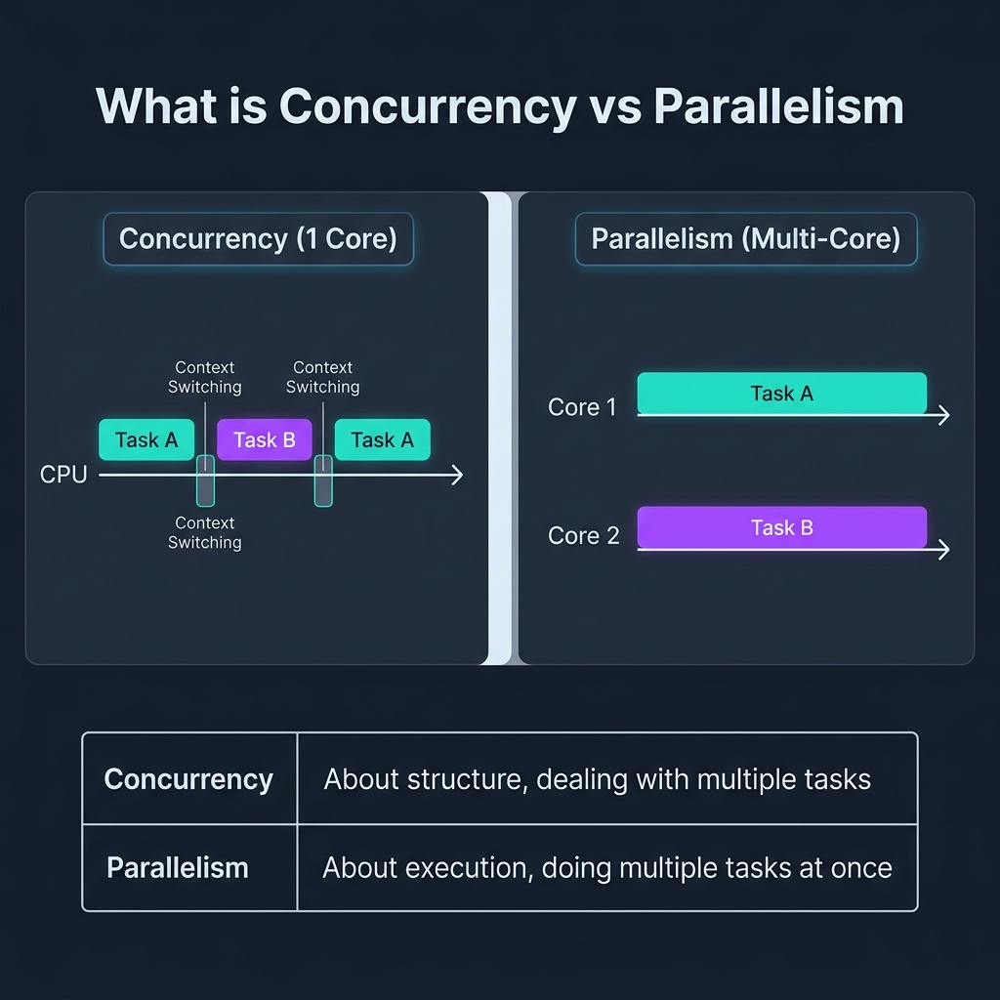
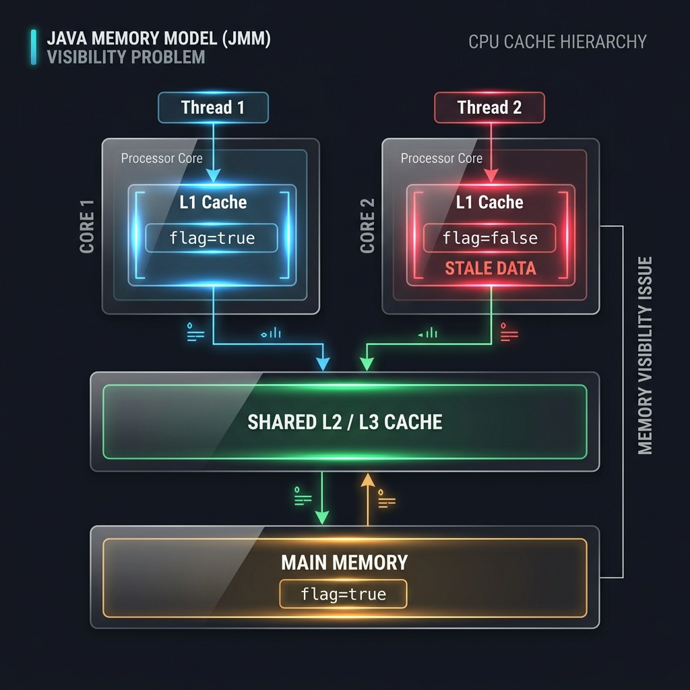
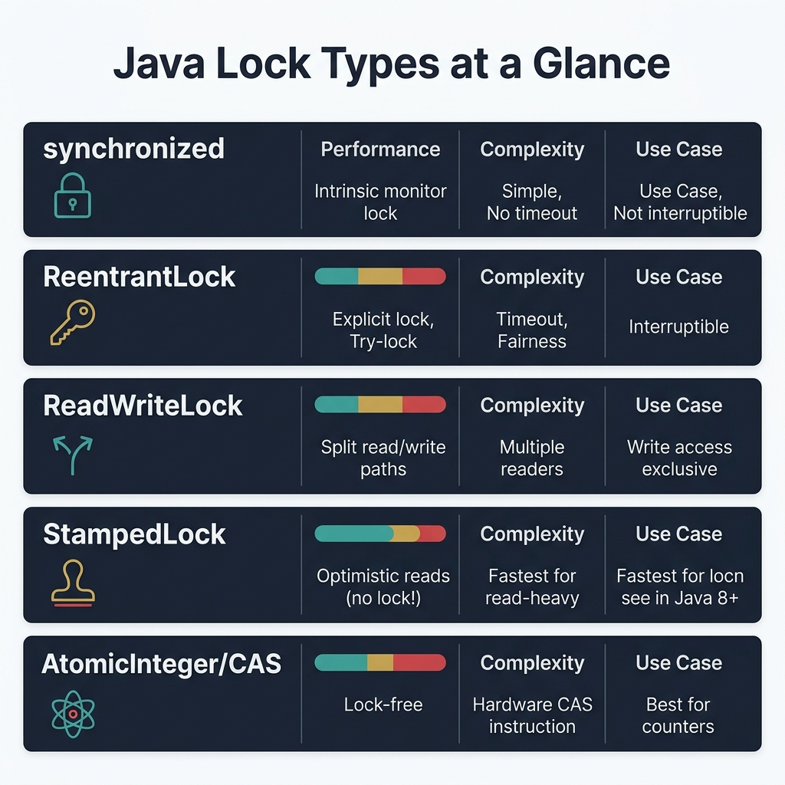
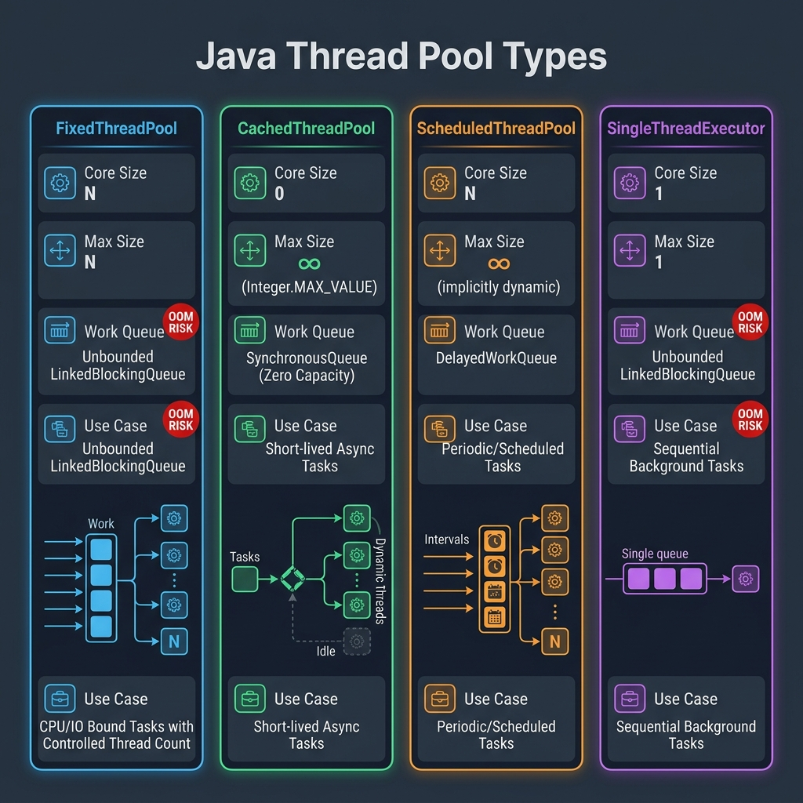
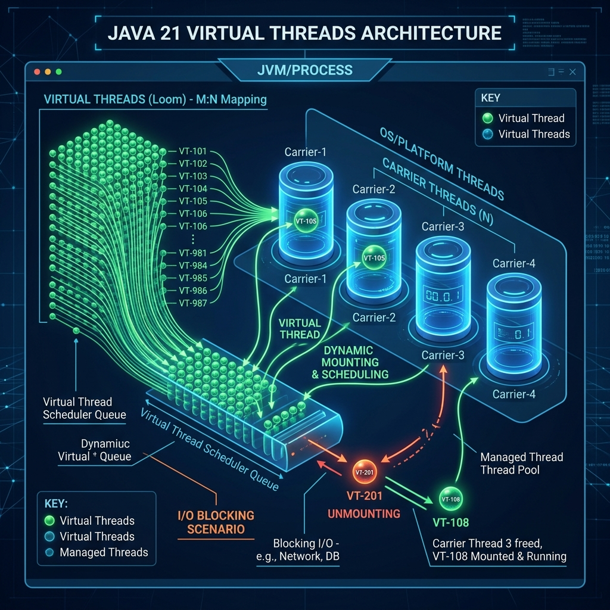
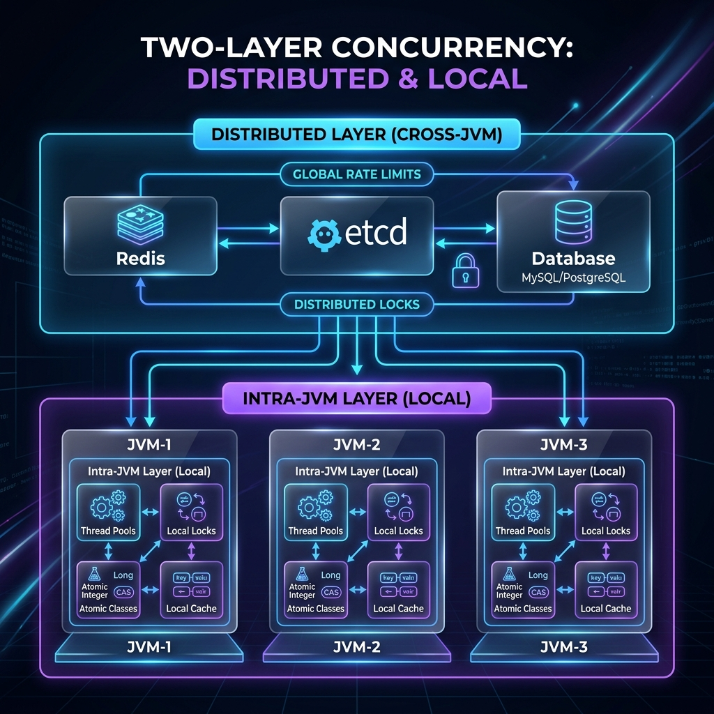
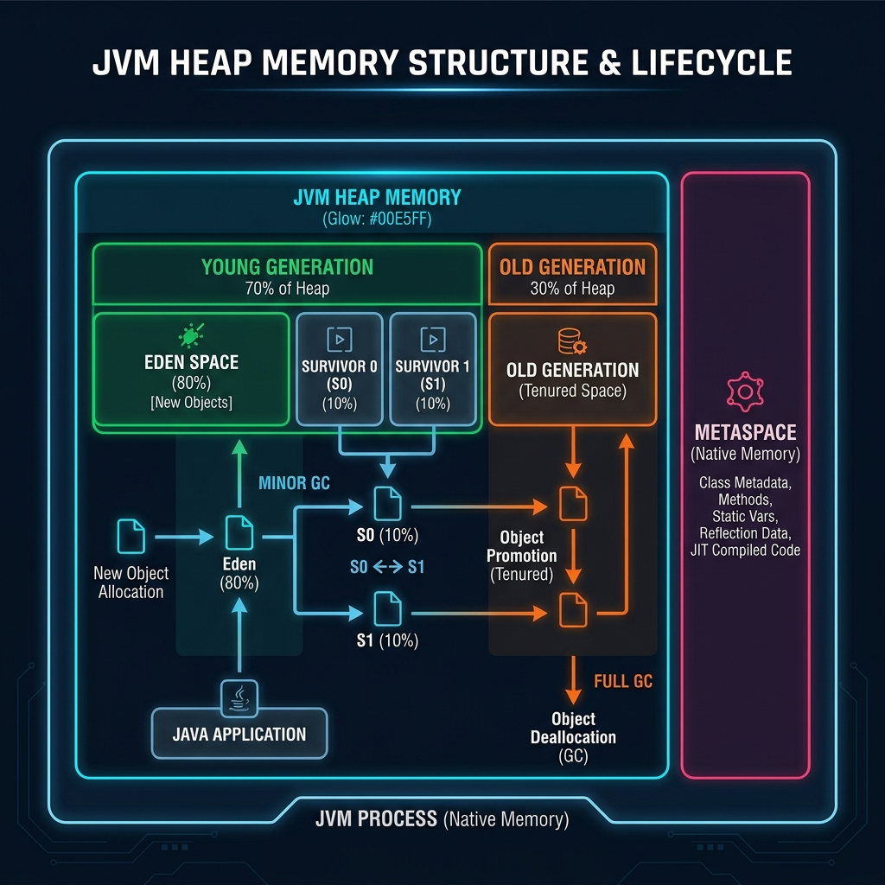

# **Advanced Java: Concurrency & GC in Production**
## Principal Engineer Presentation to Development Team

### Assumptions & Environment
- **Java Version:** Examples assume **Java 17** as the baseline. Any features that require **Java 21+** (for example, *virtual threads*) are explicitly labeled as such.
- **Ecosystem:** Core concepts are demonstrated using **plain Java SE**. A few slides include **optional Spring Boot–style examples** (REST controllers, schedulers) to connect the ideas to real-world microservices.
- **Usage Mode:** This deck is designed for **learning and workshops**:
  - each major topic includes **concrete code examples** you can paste into a small demo project;
  - many slides naturally suggest **small exercises** (e.g., “refactor this to use ReadWriteLock”, “add GC logging and inspect the output”).
- **Scope:** Focus is on **in-process concurrency**, **multi‑JVM coordination**, and **GC/heap behavior** in production JVMs.

---

## **TABLE OF CONTENTS**

### **SECTION 1: JAVA CONCURRENCY DEEP DIVE**
- Slide 1: Opening - The Concurrency Imperative
- Slide 2: Concurrency Fundamentals - What Is Concurrency?
- Slide 3: The Java Memory Model - Foundation
- Slide 4: Race Conditions - The Silent Killer
- Slide 5: Locks Deep Dive - Know Your Weapons
- Slide 6: Thread Pool Types - Production Grade
- Slide 7: CompletableFuture - Modern Async
- Slide 8: Virtual Threads (Java 21+)
- Slide 9: Lock-Free Programming - Atomic Classes
- Slide 10: Coordination Utilities
- Slide 11: Deadlock Prevention

### **SECTION 2: MULTI-JVM REALITY - THE DISTRIBUTED CHALLENGE**
- Slide 12: The Harsh Reality of Production
- Slide 13: Distributed Coordination Layer
- Slide 14: The Two-Layer Pattern
- Slide 15: Key Takeaways - Multi-JVM

### **SECTION 3: GARBAGE COLLECTION MASTERY**
- Slide 16: GC Fundamentals
- Slide 17: GC Events Impact
- Slide 18: GC Algorithms - Choosing Wisely
- Slide 19: Memory Leaks in Java
- Slide 20: Reference Types
- Slide 21: GC Tuning Methodology
- Slide 22: Heap Sizing Rules
- Slide 23: Production Monitoring
- Slide 24: Common GC Anti-Patterns
- Slide 25: GC Best Practices
- Slide 26: Summary - GC Mastery

### **CLOSING**
- Slide 27: Bringing It All Together
- Slide 28: Action Items
- Slide 29: Q&A and Discussion

---

# **SECTION 1: JAVA CONCURRENCY DEEP DIVE**

---

## **Slide 1: Opening - The Concurrency Imperative**

### **Title:** Why Concurrency Mastery Separates Good from Great Engineers

### **Content:**

**The Modern Reality:**
- Modern applications: 100s-1000s of concurrent requests per instance
- Single-threaded = Single-core utilization (wasted hardware investment)
- **Critical insight:** Thread safety bugs are production killers - silent, intermittent, catastrophic

**Key Statistics:**
- Race conditions: ~30% harder to debug than regular bugs
- Average cost of production race condition: 4-8 hours of emergency response
- Modern servers: 64-128 cores → Must exploit parallelism

**Why This Matters:**
- Performance: Utilize all available CPU cores
- Responsiveness: Non-blocking I/O and async operations
- Scalability: Handle increasing load without linear hardware growth
- Reliability: Prevent data corruption and race conditions

**Presenter Notes:**
- Start with a real production incident example from your organization
- Emphasize that concurrency bugs often surface only under load
- Set the tone: This is not academic, this is production survival

---

## **Slide 2: Concurrency Fundamentals - What Is Concurrency?**

### **Title:** Concurrency vs. Parallelism vs. Multithreading

### **Content:**

**Core Definitions:**

| Term | Definition |
|------|-----------|
| **Concurrency** | *Structure* — dealing with multiple tasks at once (interleaving on a single core via context-switching) |
| **Parallelism** | *Execution* — doing multiple tasks simultaneously (on multiple CPU cores at the same time) |
| **Multithreading** | A programming model where multiple threads execute within the same process, sharing the same JVM heap |

**Visual Model:**



**The Java Thread Lifecycle:**
```
NEW → RUNNABLE → (BLOCKED / WAITING / TIMED_WAITING) → TERMINATED
  |       |               ↑___________________________|
  |   OS scheduler     Woken up by notify/lock release
  └── start()
```
- **NEW**: Thread created but not yet started
- **RUNNABLE**: Eligible to run (may or may not be actively running on a CPU core)
- **BLOCKED**: Waiting to acquire a monitor lock
- **WAITING/TIMED_WAITING**: Voluntarily idle (sleeping, waiting for I/O or another thread)
- **TERMINATED**: Execution completed

**Why Concurrency Is Hard:**
- ❌ **Visibility** — changes in one thread may not be seen by another (CPU cache)
- ❌ **Atomicity** — `count++` is 3 CPU instructions, NOT one
- ❌ **Ordering** — JVM/CPU reorders instructions for performance

**The Three Core Problems (And Their Solutions):**

| Problem | Symptom | Solution |
|---------|---------|----------|
| **Visibility** | Stale cached reads | `volatile`, `synchronized`, `Locks` |
| **Atomicity** | Partial updates, lost data | `synchronized`, `Atomic` classes, `Locks` |
| **Ordering** | Unexpected execution order | `volatile` (happens-before), `synchronized` |

**Key Takeaway:** Concurrency is about correctly managing shared mutable state across threads. The golden rule: *prefer immutability and thread confinement over locking*.

### **References & Deep Dive**
- What Is Concurrency?: [Dev.java — Concurrency Overview](https://dev.java/learn/concurrency/)
- Java Thread States: [Oracle Java Tutorials — Thread Lifecycle](https://docs.oracle.com/javase/tutorial/essential/concurrency/threads.html)
- Concurrency vs Parallelism: [Educative — Concurrency vs Parallelism](https://www.educative.io/blog/concurrency-vs-parallelism)

**Presenter Notes:**
- Start by polling: "Raise your hand if you've dealt with a concurrency bug in production."
- Emphasize: Java concurrency is fundamentally about memory visibility and atomic operations, NOT just about "running things fast".
- The lifecycle diagram is useful for debugging: thread dumps show exactly which state each thread is in.

---

## **Slide 3: The Java Memory Model - Foundation**

### **Title:** Understanding the Real Enemy: Memory Visibility

### **Content:**

**The CPU Cache Hierarchy Reality:**



**The Problem:**
- Each CPU core has its own L1 cache (fastest, most recent)
- Threads running on different cores may see different values
- Without synchronization, changes may never propagate
- Leads to infinite loops, incorrect state, data corruption

**Critical Takeaways:**
- ❌ Operations are NOT atomic by default (even `count++`)
- ❌ CPU caches create visibility problems
- ✅ `volatile` ensures visibility, NOT atomicity
- ✅ `synchronized` provides BOTH mutual exclusion AND memory visibility

**The Happens-Before Guarantee:**
- Write to volatile → Read from volatile
- Unlock monitor → Lock same monitor
- Thread start → First statement in new thread
- Final statement in thread → Thread.join() returns

**Best Practice:** 
Always assume memory is cached unless proven otherwise. Use proper synchronization primitives.

### **References & Deep Dive**
- Official Java Tutorial on Memory Visibility: [Dev.java - Concurrency & Visibility](https://dev.java/learn/concurrency/)
- Understanding the Java Memory Model: [JSR-133 FAQ](https://www.cs.umd.edu/~pugh/java/memoryModel/jsr-133-faq.html)
- Close Encounters of The Java Memory Model Kind: [Aleksey Shipilëv's JMM Deep Dive](https://shipilev.net/blog/2016/close-encounters-of-jmm-kind/)

**Presenter Notes:**
- Show the CPU cache hierarchy diagram to explain how Core 1 and Core 2 might cache different values for the same variable.
- Emphasize that this is hardware-level behavior, not a Java quirk
- Mention that this affects ALL multi-threaded programming, not just Java

---

## **Slide 4: Race Conditions - The Silent Killer**

### **Title:** Why `counter++` Loses Data in Production

### **Content:**

**Live Scenario - E-commerce Inventory Bug:**

```java
// Production Bug: E-commerce inventory
private int inventory = 100;

public void purchase() {
    if (inventory > 0) {     // Thread 1 reads 100
        inventory--;          // Thread 2 reads 100
    }                         // Both decrement → inventory = 99 (SOLD 2, LOST 1)
}
```

**What Happened:**
1. Thread 1 checks: `inventory > 0` (true, sees 100)
2. Thread 2 checks: `inventory > 0` (true, sees 100)
3. Thread 1 decrements: `inventory = 99`
4. Thread 2 decrements: `inventory = 99`
5. **Expected:** 98, **Actual:** 99 (one sale lost!)

**Real Impact:**
- Overselling inventory → backorders, customer dissatisfaction
- Financial losses (fulfilled orders at a loss)
- Compliance violations (promised but can't deliver)
- Data integrity issues cascade to other systems

**Why It's Hard to Catch:**
- Works fine in development (low concurrency)
- Manifests only under high load
- Non-deterministic (happens randomly)
- No exceptions thrown

**Engineering Solution - AtomicInteger:**

```java
private final AtomicInteger inventory = new AtomicInteger(100);

public boolean purchase() {
    // Compare-and-swap loop - thread-safe
    return inventory.updateAndGet(current ->
        current > 0 ? current - 1 : current
    ) >= 0;
}
```

### **References & Deep Dive**
- Oracle Java Documentation on Thread Interference: [Oracle Java Tutorials - Interference](https://docs.oracle.com/javase/tutorial/essential/concurrency/interfere.html)
- Guide to Atomic Variables in Java: [Baeldung - Java Atomic Variables](https://www.baeldung.com/java-atomic-variables)

**Presenter Notes:**
- Ask audience if they've experienced similar bugs
- Emphasize financial impact - makes it real
- Show that even simple operations need protection

---

## **Slide 5: Locks Deep Dive - Know Your Weapons**

### **Title:** Choosing the Right Lock for the Job

### **Content:**

**Java Lock Types at a Glance:**



**1. `synchronized` — The Intrinsic Lock**
- Built-in to every Java object (monitor-based)
- Automatic release (no finally block needed)
- JIT-optimized with biased locking and lock elision
- ❌ No timeout, not interruptible, no fairness control

```java
// Simple, correct, and JIT-optimized
public synchronized void increment() { count++; }
```

**2. `ReentrantLock` — The Explicit Lock (Modern Preferred)**
- Supports `tryLock(timeout)`, interrupt, and fairness mode
- Must unlock in `finally` block (risk if forgotten)
- ✅ **Use when**: timeout needed, conditional wait (`Condition`), or fairness required

```java
private final ReentrantLock lock = new ReentrantLock();

public void processWithTimeout() throws InterruptedException {
    if (lock.tryLock(1, TimeUnit.SECONDS)) {
        try { /* critical section */ }
        finally { lock.unlock(); } // MUST be in finally!
    } else {
        throw new TimeoutException("Lock not acquired");
    }
}
```

**3. `ReadWriteLock` — Read-Optimized Concurrency**
- Allows **multiple concurrent readers**, but **exclusive writers**
- ✅ **Use when**: read:write ratio ≥ 10:1 (e.g., caches, config)

```java
private final ReadWriteLock rwLock = new ReentrantReadWriteLock();

public String read(String key) {
    rwLock.readLock().lock();   // Multiple threads can hold this at once
    try { return cache.get(key); } finally { rwLock.readLock().unlock(); }
}

public void write(String key, String value) {
    rwLock.writeLock().lock();  // Exclusive: blocks all readers & writers
    try { cache.put(key, value); } finally { rwLock.writeLock().unlock(); }
}
```

**4. `StampedLock` — Optimistic Reads (Java 8+, Highest Performance)**
- Optimistic read mode: **no lock acquired** — validate after reading
- If validation fails, fall back to a pessimistic read lock
- ✅ **Use when**: extreme read throughput needed (e.g., market data, sensor streams)

```java
private final StampedLock sl = new StampedLock();

public double readBalance() {
    long stamp = sl.tryOptimisticRead(); // No lock taken!
    double value = balance;
    if (!sl.validate(stamp)) {           // Was there a write since the stamp?
        stamp = sl.readLock();           // Fall back to real read lock
        try { value = balance; } finally { sl.unlockRead(stamp); }
    }
    return value; // Fast path: zero contention overhead
}
```

**5. Lock-Free: `AtomicInteger` / CAS**
- Hardware-level compare-and-swap (no OS call, no thread sleep)
- ✅ **Use when**: simple counters, flags, or single-variable state
- ❌ **Not for**: multi-variable atomic updates (use locks)

**Decision Framework: What Lock Should I Use?**

| Scenario | Recommended Lock |
|----------|----------------|
| Simple critical section | `synchronized` |
| Need timeout or interruptibility | `ReentrantLock` |
| High read, low write (cache, config) | `ReadWriteLock` |
| Maximum read throughput, rare writes | `StampedLock` |
| Counters, flags, single-variable | `AtomicInteger` / `AtomicLong` |

**The Modern Way (Java 17+):** Prefer `ReentrantLock` over `synchronized` when explicit control is needed. For Virtual Thread workloads (Java 21+), use `ReentrantLock` to avoid pinning (see Slide 8).

### **References & Deep Dive**
- Oracle Java Tutorials — Lock Objects: [Oracle Docs — Locks](https://docs.oracle.com/javase/tutorial/essential/concurrency/newlocks.html)
- ReentrantReadWriteLock Javadoc: [java.util.concurrent.locks.ReentrantReadWriteLock](https://docs.oracle.com/en/java/javase/17/docs/api/java.base/java/util/concurrent/locks/ReentrantReadWriteLock.html)
- StampedLock Guide: [Baeldung — Guide to StampedLock](https://www.baeldung.com/java-stamped-lock)
- Lock Types Comparison: [Educative — Java Locks Deep Dive](https://www.educative.io/blog/java-multithreading-and-concurrency-part-2)

**Presenter Notes:**
- Emphasize that `synchronized` is still the right default — modern JVMs apply biased locking, making it nearly as fast as explicit locks for uncontended cases.
- The StampedLock optimistic read pattern is a great example of "assume best case, validate if wrong" — no lock, maximum throughput.
- Ask: "Which lock type would you use for a high-read product catalog that updates every 10 minutes?"

---

## **Slide 6: Thread Pool Types - Production Grade**

### **Title:** Know Your Executors — Never Create Threads Manually

### **Content:**

**Anti-Pattern (Memory Bomb):**
```java
// DON'T DO THIS IN PRODUCTION!
for (Request req : requests) {
    new Thread(() -> process(req)).start();
    // 10,000 requests = 10,000 threads = ~10GB RAM!
}
```

**Java Thread Pool Types:**



**1. `FixedThreadPool` — Predictable, Bounded Threads**
```java
// N worker threads, unbounded LinkedBlockingQueue (⚠️ OOM Risk!)
ExecutorService fixed = Executors.newFixedThreadPool(
    Runtime.getRuntime().availableProcessors()
);
```
- **When to use:** CPU-bound or I/O-bound tasks where thread count must be controlled.
- **⚠️ Caution:** Unbounded queue — if tasks arrive faster than they're consumed, the queue grows to OOM.

**2. `CachedThreadPool` — Elastic Threads for Short-Lived Tasks**
```java
// core=0, max=∞, SynchronousQueue (handoff queue)
ExecutorService cached = Executors.newCachedThreadPool();
```
- **When to use:** Large numbers of short-lived async tasks (e.g., fire-and-forget notifications).
- **⚠️ Caution:** Unbounded threads — under load spikes, can create thousands of threads → OOM.

**3. `ScheduledThreadPool` — Delayed & Periodic Tasks**
```java
ScheduledExecutorService scheduler = Executors.newScheduledThreadPool(4);

// One-shot delay
scheduler.schedule(() -> sendReminder(user), 5, TimeUnit.MINUTES);

// Recurring with fixed rate (every 30s regardless of task duration)
scheduler.scheduleAtFixedRate(() -> refreshCache(), 0, 30, TimeUnit.SECONDS);

// Recurring with fixed delay (30s after EACH completion)
scheduler.scheduleWithFixedDelay(() -> checkHealth(), 0, 30, TimeUnit.SECONDS);
```
- **When to use:** Background jobs, health checks, cache refresh, scheduled cleanup.
- **Note:** `scheduleAtFixedRate` vs `scheduleWithFixedDelay` — choose based on whether you need "wall-clock" intervals or "completion-based" intervals.

**4. `SingleThreadExecutor` — Sequential Background Worker**
```java
// Guaranteed sequential ordering of tasks
ExecutorService single = Executors.newSingleThreadExecutor();
single.submit(() -> writeAuditLog(event1)); // Always before event2
single.submit(() -> writeAuditLog(event2));
```
- **When to use:** Ordered processing (e.g., audit logs, event sourcing).
- **⚠️ Caution:** Unbounded queue — same risk as FixedThreadPool.

**Production Best Practice — Use a Custom Bounded Pool:**
```java
ThreadPoolExecutor executor = new ThreadPoolExecutor(
    10,                                       // corePoolSize
    50,                                       // maximumPoolSize (burst)
    60, TimeUnit.SECONDS,                     // idle thread keepAlive
    new ArrayBlockingQueue<>(1000),           // BOUNDED queue (prevents OOM)
    new ThreadPoolExecutor.CallerRunsPolicy() // backpressure on overflow
);
```

**Sizing Formulas:**
- **CPU-Bound:** `Threads = CPU Cores` (e.g., `Runtime.getRuntime().availableProcessors()`)
- **I/O-Bound:** `Threads = Cores × (1 + Wait Time / Compute Time)`

### **References & Deep Dive**
- Oracle Java Tutorials — Thread Pools: [Oracle Docs — Executor](https://docs.oracle.com/javase/tutorial/essential/concurrency/pools.html)
- ScheduledExecutorService Javadoc: [java.util.concurrent.ScheduledExecutorService](https://docs.oracle.com/en/java/javase/17/docs/api/java.base/java/util/concurrent/ScheduledExecutorService.html)
- Thread Pool Guide: [Baeldung — Guide to Thread Pools in Java](https://www.baeldung.com/thread-pool-java-and-guava)
- Choosing Thread Pool Size: [Educative — Executor Framework in Java](https://www.educative.io/courses/java-multithreading-for-senior-engineering-interviews)

**Presenter Notes:**
- Emphasize: `Executors.newFixedThreadPool` and `newCachedThreadPool` have hidden OOM risks. Production code should use `ThreadPoolExecutor` directly with explicit bounds.
- `CallerRunsPolicy` is a natural backpressure mechanism: when the bounded queue is full, the calling thread itself executes the task, slowing the producer.
- Ask: "What thread pool do you use in your Spring `@Async` configuration?" (Default is a SimpleAsyncTaskExecutor — unbounded!)

---

## **Slide 7: CompletableFuture - Modern Async**

### **Title:** Say Goodbye to Callback Hell

### **Content:**

**Old Way (Blocking, Sequential):**

```java
// Blocking approach - wastes threads
public DashboardData getDashboard(Long userId) {
    User user = userService.getUser(userId);           // Blocks 100ms
    Orders orders = orderService.getOrders(userId);     // Blocks 150ms
    Payment payment = paymentService.getPayment(userId); // Blocks 80ms

    return new DashboardData(user, orders, payment);
    // Total: 330ms sequential
}
```

**Modern Way (Non-blocking, Parallel):**

```java
public CompletableFuture<DashboardData> getDashboard(Long userId) {
    CompletableFuture<User> userFuture =
        CompletableFuture.supplyAsync(() -> userService.getUser(userId));

    CompletableFuture<Orders> ordersFuture =
        CompletableFuture.supplyAsync(() -> orderService.getOrders(userId));

    CompletableFuture<Payment> paymentFuture =
        CompletableFuture.supplyAsync(() -> paymentService.getPayment(userId));

    // Combine all three
    return CompletableFuture.allOf(userFuture, ordersFuture, paymentFuture)
        .thenApply(v -> new DashboardData(
            userFuture.join(),
            ordersFuture.join(),
            paymentFuture.join()
        ));

    // Total: 150ms parallel (longest operation wins)
    // Performance Gain: 2.2x faster
}
```

**Key Composition & Error Handling Methods:**
- **Transformation:** `thenApply(Function)` / `thenApplyAsync` (transform result when ready)
- **Chaining:** `thenCompose(Function)` (flat-maps another async operation sequentially)
- **Combination:** `thenCombine(CompletableFuture, BiFunction)` (combines two independent operations)
- **Aggregation:** `allOf(futures...)` / `anyOf(futures...)` (resolves when all or any complete)
- **Recovery:** `exceptionally(Function)` (fallbacks on error) / `handle(BiFunction)` (recovers result or error)

**Best Practices:**
- ✅ Use for I/O-bound operations (API calls, DB queries)
- ✅ Combine independent operations with `thenCombine` or `allOf`
- ✅ Always handle exceptions (exceptionally, handle, whenComplete)
- ✅ Don't block on `join()` or `get()` in async code
- ❌ Don't use for CPU-bound tasks (use ForkJoinPool)

### **References & Deep Dive**
- Official Guide to CompletableFuture: [Dev.java - CompletableFuture](https://dev.java/learn/concurrency/completable-future/)
- CompletableFuture Javadoc: [java.util.concurrent.CompletableFuture](https://docs.oracle.com/en/java/javase/17/docs/api/java.base/java/util/concurrent/CompletableFuture.html)
- Guide to CompletableFuture: [Baeldung - CompletableFuture in Java](https://www.baeldung.com/java-completablefuture)

**Presenter Notes:**
- Show actual latency improvements with parallel calls
- Emphasize non-blocking = better thread utilization
- Compare to JavaScript Promises (similar concept)

---

## **Slide 8: Virtual Threads (Java 21+)**

### **Title:** The Game Changer for I/O-Heavy Applications

### **Content:**

**Traditional Platform Threads (Pre-Java 21):**
- OS-managed (expensive to create)
- ~1MB stack per thread
- Max ~few thousand threads per JVM
- Context switching overhead
- Thread-per-request model doesn't scale

**Virtual Threads (Java 21+):**
- JVM-managed (lightweight)
- Tiny memory footprint (~few KB)
- **Millions** of virtual threads possible
- Mounted on platform threads only when needed
- Write blocking code that scales like async code

**Architecture & Carrier Thread Mounting:**



**How It Works:**
- Virtual Threads are managed by the JVM rather than the OS.
- They have a tiny memory footprint (~few KB compared to ~1MB for platform threads).
- They are mounted on a pool of carrier (platform) threads only when running.
- **Unmounting on I/O:** When a virtual thread performs blocking I/O (e.g. DB or HTTP call), it is automatically unmounted from the carrier thread, freeing it up to run other virtual threads.

**Use Case (High-Concurrency Spring Boot REST API):**

```java
@RestController
public class OrderController {

    @GetMapping("/orders/{id}")
    public Order getOrder(@PathVariable Long id) {
        // Runs on a virtual thread - blocking calls are extremely cheap!
        
        PaymentInfo payment = paymentClient.getPayment(id); // Blocks 100ms (unmounts)
        Order order = orderRepository.findById(id);        // Blocks 50ms (unmounts)
        
        return order; // Remounts when database/network response is ready
    }
}
```

**Spring Boot Configuration (3.2+):**
```properties
spring.threads.virtual.enabled=true
```

**Benchmark (10k concurrent requests, 100ms I/O delay):**
- **Platform Threads (pool of 200):** ~5000ms duration, 200MB memory, 2,000 req/sec
- **Virtual Threads:** ~100ms duration, 50MB memory, 100,000 req/sec (50x throughput!)

**Critical Gotcha - Pinning Issue:**
Virtual threads cannot unmount from the carrier thread if they block while executing inside a `synchronized` block or calling native methods. 
*Fix:* Replace `synchronized` blocks that contain I/O calls with `ReentrantLock`.

### **References & Deep Dive**
- OpenJDK JEP 444 (Virtual Threads): [JEP 444](https://openjdk.org/jeps/444)
- Official Guide to Virtual Threads: [Dev.java - Virtual Threads](https://dev.java/learn/concurrency/virtual-threads/)
- Spring Boot Virtual Threads: [Spring Blog - Virtual Threads Support](https://spring.io/blog/2023/10/16/virtual-threads-in-spring-boot-3-2)

**Presenter Notes:**
- Virtual Threads represent a massive paradigm shift: write synchronous, simple blocking code that scales as well as complex reactive/async code.
- Emphasize checking for pinning issues using `-XX:+TracePinnedThreads` JVM flag.

---

## **Slide 9: Lock-Free Programming - Atomic Classes**

### **Title:** CAS: The Foundation of High-Performance Concurrency

### **Content:**

**Compare-And-Swap (CAS) - Hardware Atomic Operation:**

```java
// Pseudo-code of CAS operation
boolean compareAndSwap(int expected, int newValue) {
    // ALL AS ONE ATOMIC CPU INSTRUCTION
    if (this.value == expected) {
        this.value = newValue;
        return true; // Success
    } else {
        return false; // Someone else changed it
    }
}
```

**How CAS Works:**
1. Read current value
2. Compute new value
3. Atomically check if value hasn't changed
4. If unchanged, update; if changed, retry

**AtomicInteger Implementation:**

```java
public class AtomicInteger {
    private volatile int value;

    public final int incrementAndGet() {
        int current, next;
        do {
            current = value;
            next = current + 1;
        } while (!compareAndSet(current, next));
        return next;
    }
}
```

**Real-World Example (Production-grade Metrics Collector):**

```java
public class MetricsCollector {
    private final AtomicLong requestCount = new AtomicLong(0);
    private final AtomicLong errorCount = new AtomicLong(0);
    private final AtomicReference<LocalDateTime> lastUpdate =
        new AtomicReference<>(LocalDateTime.now());

    public void recordRequest() {
        requestCount.incrementAndGet(); // Atomic increment
        lastUpdate.set(LocalDateTime.now()); // Thread-safe reference write
    }

    public void recordError() {
        errorCount.incrementAndGet();
    }

    public Metrics getMetrics() {
        return new Metrics(
            requestCount.get(),
            errorCount.get(),
            lastUpdate.get()
        );
    }
}
```

**Key Atomic Classes:**
- **Scalar Atomics:** `AtomicInteger`, `AtomicLong`, `AtomicBoolean`
- **Reference Atomics:** `AtomicReference` (useful for complex state updates using `compareAndSet` or `updateAndGet`)
- **Array Atomics:** `AtomicIntegerArray`, `AtomicLongArray`, `AtomicReferenceArray`

**The ABA Problem:**
In lock-free algorithms, if a thread reads value `A`, another thread changes it `A → B → A`, and the first thread executes CAS, the CAS will succeed because the value is still `A`, even though it was modified.
*Solution:* Use `AtomicStampedReference` to associate a stamp (version number) with the reference.

**When to Use Atomics:**
- ✅ Simple counters, metrics, and flags
- ✅ Single-variable thread-safe updates under low-to-medium contention
- ❌ Complex multi-step operations that require atomic coordination across multiple variables (use Locks/Synchronized instead)

### **References & Deep Dive**
- Oracle Java Documentation on Atomic Variables: [Oracle Java Tutorials - Atomic Variables](https://docs.oracle.com/javase/tutorial/essential/concurrency/atomic.html)
- Guide to Atomic Variables in Java: [Baeldung - Java Atomic Variables](https://www.baeldung.com/java-atomic-variables)
- Java AtomicLong Javadoc: [java.util.concurrent.atomic.AtomicLong](https://docs.oracle.com/en/java/javase/17/docs/api/java.base/java/util/concurrent/atomic/AtomicLong.html)

**Presenter Notes:**
- Emphasize that Atomics are lock-free, not wait-free (they spin using compare-and-swap loop, consuming CPU cycles under heavy contention).
- Mention that under extreme thread contention, explicit locks (which sleep the thread) may perform better than atomic spin loops.

---

## **Slide 10: Coordination Utilities**

### **Title:** Don't Reinvent wait()/notify()

### **Content:**

Java provides high-level utilities for thread coordination. Use them instead of low-level wait/notify.

**1. CountDownLatch - Wait for N Events:**

**Purpose:** One or more threads wait until N operations complete

```java
// Service startup coordination
CountDownLatch startupLatch = new CountDownLatch(3);

executor.submit(() -> {
    database.start();
    System.out.println("Database started");
    startupLatch.countDown();
});

executor.submit(() -> {
    cache.start();
    System.out.println("Cache started");
    startupLatch.countDown();
});

executor.submit(() -> {
    messageQueue.start();
    System.out.println("Message queue started");
    startupLatch.countDown();
});

// Main thread waits for all services
if (!startupLatch.await(30, TimeUnit.SECONDS)) {
    throw new IllegalStateException("Services failed to start");
}

System.out.println("All services ready!");
```

**Key Methods:**
- `countDown()`: Decrement count
- `await()`: Block until count reaches zero
- `await(timeout, unit)`: Block with timeout
- `getCount()`: Get current count

**Use Cases:**
- Service initialization
- Waiting for parallel tasks to complete
- Testing (wait for background operations)

---

**Summary of Other Key Coordination Utilities:**

| Utility | Core Behavior | Common Production Use Case |
|---------|---------------|----------------------------|
| **CyclicBarrier** | $N$ threads block until all $N$ arrive at the barrier; reusable. | Parallel phased algorithms, game round sync. |
| **Semaphore** | Bounded permits controlling access to a pool of shared resources. | Database connection pools, API rate limiting. |
| **BlockingQueue** | Thread-safe queue that blocks on `put()` if full, and `take()` if empty. | Producer-Consumer pattern, worker queues. |

**Best Practices:**
- ✅ Always use standard JUC (java.util.concurrent) coordination utilities instead of low-level `wait()` and `notify()`.
- ✅ Always release semaphore permits in a `finally` block.
- ✅ Handle `InterruptedException` by restoring the interrupt status (`Thread.currentThread().interrupt()`).

### **References & Deep Dive**
- Oracle Java Documentation on Synchronizers: [Oracle Java Tutorials - Synchronizers](https://docs.oracle.com/javase/tutorial/essential/concurrency/sync.html)
- Javadocs for java.util.concurrent: [java.util.concurrent Package Summary](https://docs.oracle.com/en/java/javase/17/docs/api/java.base/java/util/concurrent/package-summary.html)
- Guide to Java Semaphores: [Baeldung - Semaphores in Java](https://www.baeldung.com/java-semaphore)

**Presenter Notes:**
- Explain how `CountDownLatch` cannot be reset, whereas `CyclicBarrier` is reusable.
- Discuss how standard thread pools (like `ThreadPoolExecutor`) use `BlockingQueue` under the hood.

---

## **Slide 11: Deadlock Prevention**

### **Title:** The Four Horsemen of Deadlock

### **Content:**

**Deadlock Definition:**
Two or more threads wait for each other indefinitely, unable to proceed.

**Conditions for Deadlock (ALL must be true):**
1. **Mutual Exclusion**: Resources can't be shared
2. **Hold and Wait**: Thread holds resource while waiting for another
3. **No Preemption**: Resources can't be forcibly taken
4. **Circular Wait**: Thread A waits for B, B waits for A

**Classic Deadlock Example:**

```java
Object lock1 = new Object();
Object lock2 = new Object();

// Thread 1
new Thread(() -> {
    synchronized(lock1) {
        System.out.println("Thread 1: Holding lock1");
        Thread.sleep(100);

        System.out.println("Thread 1: Waiting for lock2");
        synchronized(lock2) { // Blocks waiting for Thread 2 to release
            System.out.println("Thread 1: Acquired lock2");
        }
    }
}).start();

// Thread 2
new Thread(() -> {
    synchronized(lock2) {
        System.out.println("Thread 2: Holding lock2");
        Thread.sleep(100);

        System.out.println("Thread 2: Waiting for lock1");
        synchronized(lock1) { // Blocks waiting for Thread 1 to release
            System.out.println("Thread 2: Acquired lock1");
        }
    }
}).start();

// DEADLOCK! Both threads wait forever
```

**Prevention Strategy 1: Lock Ordering**

Break circular wait by always acquiring locks in consistent order:

```java
public void transfer(Account from, Account to, BigDecimal amount) {
    // Always lock accounts in ID order
    Account first = from.getId() < to.getId() ? from : to;
    Account second = first == from ? to : from;

    synchronized(first) {
        synchronized(second) {
            // Now safe from deadlock
            from.debit(amount);
            to.credit(amount);
        }
    }
}
```

**Prevention Strategy 2: Timeout with tryLock**
- Use `ReentrantLock.tryLock(timeout, unit)` to attempt lock acquisition. If the lock cannot be acquired within the timeout, release any held locks and retry/abort, breaking the "hold and wait" condition.

**Prevention Strategy 3: Lock-Free Algorithms**
- Eliminate locks entirely using `java.util.concurrent.atomic` classes or thread-safe collections.

**Detection in Production:**
- **Thread Dump Analysis:** Generate a thread dump using `jstack <pid>` and look for "Found 1 deadlock."
- **Monitoring Tools:** Use JConsole, VisualVM, or Java Mission Control (JMC) for live deadlock monitoring.
- **Programmatic Detection:** Periodically query `ThreadMXBean.findDeadlockedThreads()` in a background health-check thread to detect deadlocks.

**Best Practices:**
- ✅ Always acquire locks in a consistent global order.
- ✅ Use `tryLock` with a timeout instead of raw blocking `lock()`.
- ✅ Keep critical sections as short as possible.
- ✅ Avoid calling foreign/external code (like third-party APIs) while holding a lock.
- ❌ Never lock multiple resources unless absolutely necessary.

### **References & Deep Dive**
- Oracle Java Documentation on Deadlock: [Oracle Java Tutorials - Deadlock](https://docs.oracle.com/javase/tutorial/essential/concurrency/deadlock.html)
- Guide to Deadlock in Java: [Baeldung - Deadlock in Java](https://www.baeldung.com/java-deadlock)
- Diagnosing Deadlocks Programmatically: [ThreadMXBean Javadoc](https://docs.oracle.com/en/java/javase/17/docs/api/java.management/java/lang/model/util/class-use/ElementFilter.html)

**Presenter Notes:**
- Show a real thread dump example from a production deadlock during the Q&A session.
- Emphasize that deadlocks are a complete system freeze, and threads waiting in a deadlock do not consume CPU but consume system resources.

---

# **SECTION 2: MULTI-JVM REALITY - THE DISTRIBUTED CHALLENGE**

---

## **Slide 12: The Harsh Reality of Production**

### **Title:** Your Perfect Concurrency Code Just Became Useless (Kind Of)

### **Content:**

**Development Environment (Single JVM):**
```
┌─────────────────────────────┐
│      Your Application       │
│                             │
│  ✅ synchronized works      │
│  ✅ AtomicInteger works     │
│  ✅ ReentrantLock works     │
│  ✅ All concurrency perfect │
└─────────────────────────────┘

Everything thread-safe!
All tests pass!
```

**Production Environment (Multi-JVM Horizontal Scaling):**
```
                Load Balancer
                      ↓
      ┌───────────────┼───────────────┐
      │               │               │
  ┌───▼───┐       ┌───▼───┐       ┌───▼───┐
  │ JVM 1 │       │ JVM 2 │       │ JVM 3 │
  │       │       │       │       │       │
  │ ✅ sync│       │ ✅ sync│       │ ✅ sync│
  │ works │       │ works │       │ works │
  └───────┘       └───────┘       └───────┘

  ✅ Thread-safe WITHIN each JVM
  ❌ NO synchronization ACROSS JVMs!
```

**The Hard Truth:**
- Each JVM is a **separate process** with its own memory
- JVMs don't share heap memory
- `synchronized` blocks only affect threads **within the same JVM**
- `AtomicInteger` counters are **per-JVM**, not global
- Static variables are **per-JVM**, not shared

**Example of the Problem:**

```java
// This code is thread-safe WITHIN one JVM
@Service
public class VisitorCounter {
    private final AtomicInteger count = new AtomicInteger(0);

    public int incrementAndGet() {
        return count.incrementAndGet();
    }

    public int getCount() {
        return count.get();
    }
}

// With 3 JVM instances:
// User makes request → JVM 1: count = 1
// User makes request → JVM 2: count = 1  ← Same user, different JVM!
// User makes request → JVM 3: count = 1
// Total visits: 3, but each JVM shows count = 1
```

**What Still Works:**
- ✅ Thread safety **within** each JVM instance
- ✅ Handling concurrent requests in one instance
- ✅ Local caching
- ✅ Thread pools
- ✅ Request-scoped data

**What Breaks:**
- ❌ Global counters/metrics
- ❌ Distributed locks
- ❌ Unique ID generation
- ❌ Rate limiting across instances
- ❌ Leader election
- ❌ Cache coherence

**Presenter Notes:**
- This is the biggest "gotcha" for developers moving to production
- Emphasize that JVM concurrency is NOT obsolete, just insufficient alone
- Real story: Production incident where counter was off by 4x (4 instances)

---

## **Slide 13: Distributed Coordination Layer**

### **Title:** When JVM Primitives Are Not Enough

### **Content:**

**The Production Reality - Rate Limiter Incident:**

```
E-commerce API: 1000 req/min per user — deployed to 4 JVM instances

User ABC sends 4000 requests/minute:
  JVM 1 → counter[ABC] = 1000 ✅  (at limit, all allowed)
  JVM 2 → counter[ABC] = 1000 ✅  (at limit, all allowed)
  JVM 3 → counter[ABC] = 1000 ✅  (at limit, all allowed)
  JVM 4 → counter[ABC] = 1000 ✅  (at limit, all allowed)

Expected: 1000 requests blocked after limit
Actual:   4000 requests passed (4× the limit!) ❌
```

**Root Cause:** `AtomicInteger` is per-JVM. Each instance had its own independent counter.

**The Fix — Redis Distributed Counter:**
```java
public boolean allowRequest(String userId) {
    String key = "rate_limit:" + userId;
    Long count = redis.opsForValue().increment(key);  // atomic across ALL JVMs
    if (count == 1) redis.expire(key, 1, TimeUnit.MINUTES);
    return count <= 1000;
}
```

**When JVM Primitives Fail — Distributed Solutions:**

| Problem | JVM Primitive (Fails) | Distributed Solution |
|---------|----------------------|---------------------|
| Global rate limit | `AtomicInteger` (per JVM) | Redis INCR + TTL |
| Distributed mutex | `synchronized` (per JVM) | Redis/Redisson RLock |
| Leader election | Not applicable | Zookeeper / etcd |
| Global counter | `AtomicLong` (per JVM) | Redis counter |
| Cache coherence | `ConcurrentHashMap` (stale) | Redis Pub/Sub invalidation |
| Idempotency | Not feasible | Redis/DB with unique key |

**Technology Stack Comparison:**

| Technology | Complexity | Performance | Best For |
|------------|-----------|-------------|---------|
| **Redis (Redisson)** | Low | High | Locks, counters, caching |
| **Zookeeper / etcd** | High | Medium | Leader election, consensus |
| **Database (SQL)** | Low | Low | Transactional locks |
| **Hazelcast** | Medium | High | In-memory distributed grids |

**Production-Grade Distributed Locking with Redisson:**
```java
RLock lock = redisson.getLock("task:" + taskId);
try {
    if (lock.tryLock(10, 60, TimeUnit.SECONDS)) {  // wait 10s, hold 60s
        try { processTask(taskId); }
        finally { lock.unlock(); }
    }
} catch (InterruptedException e) { Thread.currentThread().interrupt(); }
```

### **References & Deep Dive**
- Redis Distributed Locks: [Redis Redlock Pattern](https://redis.io/docs/manual/patterns/distributed-locks/)
- Redisson Wiki: [Redisson — Locks & Synchronizers](https://github.com/redisson/redisson/wiki/8.-Locks-and-Synchronizers)
- Baeldung Rate Limiting: [Baeldung — Rate Limiting a Spring API](https://www.baeldung.com/spring-keycloak-rate-limiting)

**Presenter Notes:**
- The rate limiter story is a classic "looks correct" bug that only surfaces in production. Always ask: "Is this counter shared across instances?"
- Redisson's Watchdog automatically renews the lease time so a slow task doesn't lose the lock prematurely. If the JVM crashes, the lease expires and the lock is released.

---

## **Slide 14: The Two-Layer Pattern**

### **Title:** JVM + Distributed Concurrency — Both Are Essential

### **Content:**

**Critical Insight:** JVM concurrency is NOT obsolete in a multi-JVM world — it's the foundation. You need BOTH layers.

**Two-Layer Production Pattern:**

```java
@Service
public class OrderProcessingService {

    // LAYER 2: Distributed coordination (cross-JVM)
    private final RedissonClient redisson;

    // LAYER 1: JVM-local coordination (within this JVM)
    private final ReentrantLock localLock = new ReentrantLock();
    private final ConcurrentHashMap<String, Order> localCache = new ConcurrentHashMap<>();

    public void processOrder(String orderId) {
        RLock distributedLock = redisson.getLock("order:" + orderId);
        try {
            if (distributedLock.tryLock(5, 30, TimeUnit.SECONDS)) {  // LAYER 2: cross-JVM
                try {
                    localLock.lock();   // LAYER 1: intra-JVM (multiple threads may retry)
                    try {
                        Order order = localCache.computeIfAbsent(orderId, this::loadOrderFromDB);
                        processOrderInternal(order);
                    } finally { localLock.unlock(); }
                } finally { distributedLock.unlock(); }
            }
        } catch (InterruptedException e) { Thread.currentThread().interrupt(); }
    }
}
```

**Mental Model:**



**Why BOTH Layers Are Needed:**

| Missing Layer | Consequence |
|--------------|-------------|
| ❌ No Distributed Lock (Layer 2) | JVM 1 and JVM 2 both process `order #123` → double charge |
| ❌ No Local Lock (Layer 1) | Thread A and Thread B in JVM 1 corrupt the local cache |
| ✅ Both Layers | One JVM processes the order, one thread at a time within it |

**Decision Flowchart:**
- **Within a single JVM?** → Use `synchronized` / `ReentrantLock` / `AtomicLong`
- **Across multiple JVMs?** → Use `Redisson RLock` / `Database pessimistic lock`
- **High-throughput + transactional?** → Use BOTH layers together

**Idempotency — The Hidden Requirement:**
Always store operation results with a TTL-based idempotency key in Redis or a DB unique constraint. This prevents duplicate processing when clients retry across instances:
```java
// Check before processing; store result after
String key = "payment:" + idempotencyKey;
PaymentResult cached = redis.opsForValue().get(key);
if (cached != null) return cached; // Already processed — return same result
PaymentResult result = paymentService.charge(request);
redis.opsForValue().set(key, result, 24, TimeUnit.HOURS);
```

### **References & Deep Dive**
- Redisson Distributed Lock: [Redisson — RLock](https://github.com/redisson/redisson/wiki/8.-Locks-and-Synchronizers)
- Stripe Idempotency: [Stripe — Idempotent Requests](https://stripe.com/docs/api/idempotent_requests)
- Baeldung Hazelcast Guide: [Baeldung — Hazelcast in Spring Boot](https://www.baeldung.com/spring-boot-hazelcast)

**Presenter Notes:**
- The two-layer pattern is the production reality in any horizontally scaled microservice.
- Ask: "Which layer is your most common production bug? Intra-JVM race condition, or cross-JVM coordination failure?"

---

## **Slide 15: Key Takeaways - Multi-JVM**

### **Title:** The Production Excellence Mindset

### **Content:**

**1. JVM Concurrency ≠ Obsolete**
- Every JVM instance handles 100s of concurrent request threads
- Thread safety ALWAYS required within each JVM — it is the foundation
- Without intra-JVM safety, distributed coordination doesn't help

**2. Two Layers, Not One:**

| Layer | Scope | Tools | Always Needed? |
|-------|-------|-------|---------------|
| **Layer 1: Intra-JVM** | Within single process | `synchronized`, `ReentrantLock`, `AtomicInteger`, `ConcurrentHashMap`, thread pools | ✅ Yes |
| **Layer 2: Distributed** | Across all JVM instances | Redis/Redisson, Zookeeper, etcd, DB locks | Only when horizontally scaled |

**3. When to Add the Distributed Layer:**
- ✅ Multiple JVM instances behind a load balancer
- ✅ Global state required (counters, rate limits, leader)
- ✅ Cache coherence across instances
- ✅ Idempotency for retried requests

**4. Start Simple, Scale Smart:**
- Single instance → JVM concurrency alone is sufficient
- Horizontal scaling → Add distributed layer incrementally
- Don't over-engineer before you need it

**5. Common Production Patterns:**

| Pattern | Solution |
|---------|---------|
| Rate limiting | Redis INCR with TTL |
| Unique IDs | Snowflake / DB sequence |
| Distributed lock | Redis Redlock / Redisson |
| Leader election | Zookeeper / etcd |
| Cache invalidation | Redis Pub/Sub |
| Idempotency | Redis / DB unique constraint |

**Remember:** Most production bugs happen at BOTH layers. Know which layer your bug is in before debugging!

**Presenter Notes:**
- This section bridges theory and practice: all Section 1 knowledge is still needed and used in production.
- Reinforce: test with multiple JVM instances locally (Docker Compose) before deploying.
- Share a real war story from your experience if available.

---

# **SECTION 3: GARBAGE COLLECTION MASTERY**

---


## **Slide 16: GC Fundamentals**

### **Title:** Memory Management - The Hidden Performance Tax

### **Content:**

**Why GC Matters:**
- GC pauses = application pauses
- Poor GC tuning = degraded user experience
- Understanding GC = troubleshooting production issues

**Heap Structure - Generational Hypothesis:**



**Generational Hypothesis:**
- **Observation:** ~98% of objects die young.
- **Strategy:** Optimize for short-lived objects by splitting the heap into Generations.
- **Result:**
  - Minor GC (Young Gen): Frequent, fast (10-50ms) copying collectors.
  - Major GC (Old Gen): Infrequent, slower (100-500ms) concurrent/compacting collectors.
  - Full GC: Collects the entire heap and Metaspace; rare in healthy applications (500ms-5s pause).

**Object Lifecycle:**
1. Created: `new Object()` is allocated in the Eden space of the Young Gen.
2. Minor GC: If it survives, it is moved to Survivor 0 (S0).
3. Copying: Subsequent Minor GCs copy survivors back and forth between S0 and S1, incrementing their age.
4. Promotion: When an object's age exceeds the promotion threshold (MaxTenuringThreshold), it is promoted to the Old Gen.

**GC Roots (What Keeps Objects Alive):**
- Local variables on thread execution stacks.
- Active system threads.
- Class static fields (held in Metaspace).
- JNI (Java Native Interface) global references.

### **References & Deep Dive**
- Official Java GC Documentation: [Oracle Java Garbage Collection Basics](https://docs.oracle.com/javase/8/docs/technotes/guides/vm/gctuning/toc.html)
- Understanding Java Heap Memory: [Baeldung - JVM Garbage Collection](https://www.baeldung.com/jvm-garbage-collectors)
- Dev.java Tutorials on JVM Memory: [Dev.java - JVM Memory Management](https://dev.java/)

**Presenter Notes:**
- Show the JVM Heap Memory Structure diagram. Explain how separating Young Gen (Eden, S0, S1) from Old Gen dramatically reduces GC pause times under the Generational Hypothesis.
- Explain that Metaspace holds class metadata and is stored in off-heap native memory (no longer in PermGen).

---

## **Slide 17: GC Events Impact**

### **Title:** Understanding the Performance Cost

### **Content:**

**Types of GC Events:**

| Event Type | Scope | Frequency | Pause Time | Stop-the-World | Impact |
|------------|-------|-----------|------------|----------------|--------|
| **Minor GC** | Young generation | Seconds | 10-50ms | Yes | Low |
| **Major GC** | Old generation | Minutes/Hours | 100-500ms | Partial | Medium |
| **Full GC** | Entire heap + metaspace | Rare (ideally never) | 500ms-5s | Yes | **CRITICAL** |

**Production Impact:**

```
Normal Application:
Requests: ████████████████████████████ (steady throughput)

During Full GC (2 seconds):
Requests: ████████████                   (pause) ████████████
          ↑                                      ↑
      GC starts                              GC ends

Impact:
- All request threads frozen
- No new requests processed
- Users see timeouts
- Load balancer may mark instance unhealthy
```

**GC Metrics to Monitor:**

**1. Heap Usage:**
- Used / Committed / Max
- Old gen growth rate (should be near zero in steady state)
- Young gen allocation rate

**2. GC Frequency:**
- Minor GC: Should happen regularly (every few seconds = healthy)
- Major GC: Infrequent (minutes to hours)
- Full GC: **SHOULD NOT HAPPEN** in steady state

**3. Pause Times:**
- Average pause time
- Max pause time
- P99 pause time (most important for SLAs)

**Real Production Example:**

```
Before Tuning:
- Full GC every 10 minutes (2s pause each)
- P99 latency: 3500ms
- Timeout rate: 5%

After Tuning (increased heap, tuned G1):
- No Full GCs
- P99 latency: 150ms
- Timeout rate: 0.1%
```

**Red Flags:**

| Symptom | Likely Cause | Action |
|---------|--------------|--------|
| Full GC every few minutes | Memory leak or heap too small | Heap dump analysis |
| Pause times >1s | Wrong GC or heap size | Change GC, adjust size |
| Old gen growing steadily | Memory leak | Find and fix leak |
| High CPU during GC | Excessive allocation rate | Reduce object creation |
| OutOfMemoryError | Leak or truly need more memory | Analyze heap dump |

### **References & Deep Dive**
- GC Logging and Monitoring: [Baeldung - Guide to GC Logging](https://www.baeldung.com/java-verbose-gc)
- Analyzing GC Pauses: [Dev.java - Garbage Collection Tuning](https://dev.java/)
- JVM Performance Tuning Basics: [Oracle JVM Tuning Guide](https://docs.oracle.com/javase/8/docs/technotes/guides/vm/gctuning/index.html)

**Presenter Notes:**
- Show real GC logs from production.
- Emphasize that Full GC = red alert.
- Discuss SLA impact (P99, P99.9).

---

## **Slide 18: GC Algorithms - Choosing Wisely**

### **Title:** Know Your Garbage Collectors

### **Content:**

**1. Serial GC (`-XX:+UseSerialGC`)**

**Characteristics:**
- Single-threaded GC
- Stop-the-world for all GC events
- Low memory overhead
- Simplest implementation

**When to Use:**
- Small applications (<100MB heap)
- Single-CPU systems
- Client applications (not servers)

**Performance:**
- Throughput: Low
- Pause times: High (100ms-1s)
- Memory overhead: Lowest

---

**2. Parallel GC (`-XX:+UseParallelGC`)**

**Characteristics:**
- Multi-threaded GC
- Stop-the-world but uses all CPU cores
- Throughput-optimized
- Default in Java 8

**When to Use:**
- Batch processing
- Number crunching
- Throughput > Latency

**Configuration:**
```bash
-XX:+UseParallelGC
-XX:ParallelGCThreads=8        # GC threads
-XX:MaxGCPauseMillis=500       # Target pause (best effort)
```

**Performance:**
- Throughput: **Highest**
- Pause times: Medium-High (200ms-1s)
- Memory overhead: Medium

---

**3. G1 GC (`-XX:+UseG1GC`) ⭐ Default Java 9+**

**Characteristics:**
- Divides heap into regions (~2048 regions)
- Predictable pause times
- Concurrent marking, parallel copying
- Balanced throughput + latency

**When to Use:**
- **General-purpose (default choice)**
- Large heaps (>4GB)
- Need predictable pauses (<200ms)
- 99% of production applications

**Configuration:**
```bash
-XX:+UseG1GC
-XX:MaxGCPauseMillis=200       # Target max pause (200ms typical)
-XX:G1HeapRegionSize=16m       # Region size
-XX:InitiatingHeapOccupancyPercent=45  # When to start marking
```

**How It Works:**
```
Heap divided into regions:
[E][E][O][O][S][E][H][E][O][E]...

E = Eden
S = Survivor
O = Old
H = Humongous (large objects)

G1 prioritizes regions with most garbage ("Garbage First")
```

**Performance:**
- Throughput: High
- Pause times: Low-Medium (50-200ms, predictable)
- Memory overhead: Medium-High
- **Best balance** for most apps

---

**4. ZGC (`-XX:+UseZGC`) - Java 15+**

**Characteristics:**
- **Ultra-low latency** (<10ms pauses)
- Concurrent (most work done concurrently)
- Scales to multi-TB heaps
- Pause times independent of heap size

**When to Use:**
- Ultra-low latency requirements
- Large heaps (>10GB, up to 16TB)
- Real-time systems
- High-frequency trading

**Configuration:**
```bash
-XX:+UseZGC
-Xms16g -Xmx16g               # Fixed heap size recommended
-XX:ZCollectionInterval=5     # Min seconds between GCs
```

**Performance:**
- Throughput: Medium-High
- Pause times: **Ultra-low (<10ms)**
- Memory overhead: Higher
- CPU overhead: Higher

**Trade-offs:**
- ✅ Consistent low latency
- ✅ Huge heap support
- ❌ Higher memory usage (~15-20% overhead)
- ❌ More CPU usage

---

**5. Shenandoah GC (`-XX:+UseShenandoahGC`)**

**Characteristics:**
- Similar goals to ZGC
- Concurrent compaction
- Low pause times

**When to Use:**
- Alternative to ZGC
- Available in OpenJDK (not Oracle JDK until Java 15)

---

**Comparison Summary:**

| GC | Pause Time | Throughput | Heap Size | Use Case |
|----|-----------|------------|-----------|----------|
| **Serial** | Highest | Lowest | <100MB | Client apps |
| **Parallel** | High | **Highest** | Any | Batch processing |
| **G1** | Medium | High | >4GB | **General purpose** |
| **ZGC** | **Lowest** | Medium | >10GB | Ultra-low latency |
| **Shenandoah** | **Lowest** | Medium | >10GB | Alternative to ZGC |

**Decision Tree:**

```
What's your priority?

├─ Maximum throughput (batch jobs)
│   └─ Use: Parallel GC
│
├─ Ultra-low latency (<10ms)
│   └─ Use: ZGC (Java 15+)
│
├─ Small heap (<100MB, client app)
│   └─ Use: Serial GC
│
└─ General purpose / Don't know
    └─ Use: G1 GC (default, best balance)
```

### **References & Deep Dive**
- ZGC (OpenJDK Wiki): [The Z Garbage Collector](https://wiki.openjdk.org/display/zgc)
- G1 Garbage Collector (Oracle Guide): [Garbage-First Garbage Collector](https://docs.oracle.com/javase/9/gctuning/garbage-first-garbage-collector.htm)
- Choosing the Right Garbage Collector: [Baeldung - Java Garbage Collection Choices](https://www.baeldung.com/jvm-garbage-collectors)

**Presenter Notes:**
- G1 GC is the safe default.
- ZGC is the future for latency-sensitive apps.
- Show GC logs comparing pause times.

---

## **Slide 19: Memory Leaks in Java**

### **Title:** Yes, Java Can Leak Memory!

### **Content:**

**Definition:** Objects that should be garbage collected but aren't because they're still referenced.

**Common Leak Patterns:**

**1. Static Collections:**
- **Leak:** Adding objects to a static `List` or `Map` and never removing them. The static reference keeps the collection alive for the entire JVM lifetime.
- **Fix:** Use a bounded cache with eviction policies or `WeakHashMap`.

**2. Unclosed Resources:**
- **Leak:** Forgetting to close streams, sockets, database connections, or files.
- **Fix:** Always use **try-with-resources** (`try (resource) { ... }`).

**3. Unregistered Listeners:**
- **Leak:** Registering a local object as a listener to a long-lived publisher/event bus and forgetting to unregister it when the local object is discarded.
- **Fix:** Implement `@PreDestroy` cleanups to unregister.

**4. ThreadLocal in Thread Pools (Production Danger):**

```java
private static final ThreadLocal<LargeContext> context = new ThreadLocal<>();

public void handleRequest() {
    // Thread pool threads are reused! If we don't call remove(), 
    // the LargeContext stays bound to the thread forever, leaking memory.
    try {
        context.set(new LargeContext()); 
        processRequest();
    } finally {
        context.remove(); // CRITICAL! Prevents leaking on thread reuse
    }
}
```

**5. Non-Static Inner Classes:**
- **Leak:** Non-static inner classes hold an implicit reference to their outer class. If the inner class is stored globally, the entire outer class is leaked.
- **Fix:** Use `static` nested classes.

**Detection & Tools:**
- **jmap heap dump:** Run `jmap -dump:live,format=b,file=heap.bin <pid>` to capture live objects.
- **Analysis:** Open the heap dump in Eclipse Memory Analyzer (MAT) or VisualVM to find the leak roots.

### **References & Deep Dive**
- Guide to Memory Leaks in Java: [Baeldung - Memory Leaks in Java](https://www.baeldung.com/java-memory-leaks)
- Understanding ThreadLocal: [Baeldung - ThreadLocal in Java](https://www.baeldung.com/java-threadlocal)
- Eclipse Memory Analyzer (MAT): [Eclipse MAT Documentation](https://www.eclipse.org/mat/)

**Presenter Notes:**
- ThreadLocal leaks in application servers (like Tomcat) are the most common source of OOM errors during hot-reloads.
- Emphasize always calling `remove()` in a `finally` block when using `ThreadLocal`.

---

## **Slide 20: Reference Types**

### **Title:** Control Object Lifetime Precisely

### **Content:**

**Reference Strength Hierarchy:**

```
Strong → Soft → Weak → Phantom
(Never GC'd)  (GC when memory low)  (GC next cycle)  (Post-finalization)
```

**1. Strong Reference (Default):**
Normal Java references (e.g. `User u = new User()`). Objects with active strong references are never garbage collected.

**2. SoftReference (Memory-Sensitive Caches):**

```java
public class ImageCache {
    private final Map<String, SoftReference<BufferedImage>> cache =
        new ConcurrentHashMap<>();

    public BufferedImage getImage(String url) {
        SoftReference<BufferedImage> ref = cache.get(url);
        if (ref != null) {
            BufferedImage img = ref.get();
            if (img != null) {
                return img; // Cache hit
            }
        }
        // Cache miss or garbage collected under memory pressure - reload
        BufferedImage img = loadImage(url);
        cache.put(url, new SoftReference<>(img));
        return img;
    }
}
```

**3. WeakReference (Canonicalizing Maps):**
Weak references do not prevent garbage collection. During a GC cycle, if an object is only weakly reachable, it is reclaimed immediately. Useful for mapping metadata to objects without preventing them from being collected (e.g., `WeakHashMap`).

**4. PhantomReference (Post-Mortem Cleanup):**
Phantom references are queued after the object has been finalized and reclaimed. `phantomRef.get()` always returns `null`. Used primarily to track when an object has been fully collected from memory (e.g., reclaiming native off-heap memory buffers).

**Summary Table:**

| Reference Type | `get()` Returns Object? | GC Reclamation Rule | Primary Production Use Case |
|----------------|-------------------------|---------------------|-----------------------------|
| **Strong** | Yes | Never (while strongly referenced) | Standard Java programming |
| **Soft** | Yes | Only when JVM is running out of memory | Memory-sensitive, discardable caches |
| **Weak** | Yes | Reclaimed during the very next GC cycle | Canonicalizing mappings (`WeakHashMap`) |
| **Phantom** | **Always null** | Reclaimed after finalization | Clean up of off-heap native resources |

### **References & Deep Dive**
- Official Javadoc for java.lang.ref: [java.lang.ref package summary](https://docs.oracle.com/en/java/javase/17/docs/api/java.base/java/lang/ref/package-summary.html)
- Understanding Java Reference Types: [Baeldung - Java Reference Types](https://www.baeldung.com/java-weak-soft-phantom-references)
- Guide to WeakHashMap: [Baeldung - WeakHashMap Guide](https://www.baeldung.com/java-weakhashmap)

**Presenter Notes:**
- Emphasize that SoftReferences are JVM-managed: they act like normal objects until the JVM feels memory pressure (e.g., heap exceeds 90%), at which point it automatically clears them to avoid throwing an OOM error.
- Explain why PhantomReference is a safer, modern alternative to overriding `finalize()`.

---

## **Slide 21: GC Tuning Methodology**

### **Title:** Five-Step GC Tuning Process

**Always Follow This Order:**
1. **Enable GC Logging** (always in production): `-Xlog:gc*:file=gc.log:time,uptime:filecount=5,filesize=20m`
2. **Establish Baseline**: Capture current GC frequency, pause times, heap utilization
3. **Identify Issues**: Look for Full GC events, long STW pauses, old gen growth
4. **Tune ONE Parameter at a Time**: Change one JVM flag, measure, compare to baseline
5. **Measure Again**: Iterate until SLOs are met

**Common Tuning Parameters:**
```bash
# Heap size (set min = max to avoid resize overhead)
-Xms4g -Xmx4g

# Container-aware heap (Java 8u191+)
-XX:MaxRAMPercentage=75.0

# G1 GC target pause time
-XX:MaxGCPauseMillis=200

# ZGC (Java 15+, ultra-low latency)
-XX:+UseZGC
```

### **References & Deep Dive**
- G1 GC Tuning Guide: [Oracle G1 GC Tuning](https://docs.oracle.com/en/java/javase/17/gctuning/garbage-first-garbage-collector-tuning.html)
- Baeldung JVM Tuning: [Baeldung — GC Tuning](https://www.baeldung.com/jvm-tuning-java)

---

## **Slide 22: Heap Sizing Rules**

### **Title:** Right-Sizing Your JVM Heap

**Golden Rule:** `Heap Size = Peak Live Data × 2 to 4`

**Key Flags:**
```bash
-Xms4g -Xmx4g          # Fixed heap (avoids resize pauses)
-XX:MaxRAMPercentage=75.0  # Container-aware (use 75% of container RAM)
-XX:NewRatio=2          # Young:Old = 1:2 (default)
```

**Sizing Guidance:**
- ✅ Monitor `Old Gen live data size` after Full GC → that's your baseline
- ✅ Set heap = 2-4× live data (leaves room for allocation and GC headroom)
- ✅ In containers: always use `-XX:MaxRAMPercentage` instead of `-Xmx`
- ❌ Never set `-Xmx` to 100% of container RAM (OOMKill risk)

---

## **Slide 23: Production Monitoring**

### **Title:** What to Monitor in Production

**Key GC Metrics:**
| Metric | Healthy Target | Warning Sign |
|--------|---------------|-------------|
| Minor GC pause | < 50ms | > 100ms |
| Major GC pause | < 300ms | > 500ms |
| Full GC frequency | < 1/day | > 1/hour |
| Old Gen usage | < 70% | > 85% |
| Heap growth rate | Stable | Climbing after GC |

**Essential Tools:**
- **`jstat -gcutil <pid> 1000`**: Live GC stats every 1s
- **VisualVM / JMC**: Heap dump, thread dump, GC timeline
- **Prometheus + Grafana**: Production dashboards with alerting

---

## **Slide 24: Common GC Anti-Patterns**

### **Title:** What NOT to Do

❌ `System.gc()` — Never call explicitly; forces Full GC
❌ `finalize()` — Deprecated; use `Cleaner` (Java 9+) instead
❌ Large static collections — Create permanent GC roots → memory leaks
❌ Unclosed `ThreadLocal` — Causes memory leaks in thread pools
❌ Ignoring GC logs — You cannot tune what you cannot measure
❌ Setting `-Xmx` without analysis — Undersizing or oversizing both hurt

---

## **Slide 25: GC Best Practices**

### **Title:** The GC Best Practice Checklist

✅ **Enable GC logging always** (zero performance cost with async logging)
✅ **Start with G1 GC** (default in Java 9+, good balance of throughput/latency)
✅ **Set `-Xms = -Xmx`** (prevents heap resize pauses under load)
✅ **Use ZGC for latency-sensitive services** (Java 15+, sub-1ms pauses)
✅ **Fix memory leaks before tuning** (no GC tuning compensates for leaks)
✅ **Monitor P99 pause times** (mean is misleading; tail latency hurts users)
✅ **Profile object allocation hot paths** with async-profiler

### **References & Deep Dive**
- ZGC Documentation: [OpenJDK ZGC](https://wiki.openjdk.org/display/zgc)
- Java GC Reference: [Baeldung — Java GC Algorithms](https://www.baeldung.com/jvm-garbage-collectors)

---

## **Slide 26: Summary - GC Mastery**

### **Title:** The GC Mastery Checklist

| Area | Key Takeaway |
|------|-------------|
| **Fundamentals** | GC = automatic memory management; STW pauses are the cost |
| **GC Algorithms** | G1 = default; ZGC = ultra-low latency (Java 15+) |
| **Heap Sizing** | Set `Xms=Xmx`; use 2-4× live data as target |
| **Memory Leaks** | ThreadLocal, static caches, and listeners are top culprits |
| **Monitoring** | Enable GC logs; track Old Gen growth and P99 pauses |
| **Anti-Patterns** | Never call `System.gc()`; never ignore GC logs |

---

# **CLOSING**

---

## **Slide 27: Bringing It All Together**

### **Title:** The Production Excellence Stack

**Three Pillars of Java Production Excellence:**

**Pillar 1: JVM Concurrency (Foundation)**
- Thread pools, locks, atomics, virtual threads
- Handles concurrent requests within each instance
- **Always required** — regardless of deployment scale

**Pillar 2: Distributed Coordination (Scale-Out)**
- Redis, Zookeeper, distributed locks, idempotency
- Coordinates state across JVM instances
- **Required when horizontally scaling**

**Pillar 3: Memory Management (Performance)**
- GC tuning, leak prevention, heap sizing
- Ensures low latency and high throughput
- **Critical for user experience SLOs**

**All Three Work Together:**
```
Production System
    ├─ Distributed Layer (Redis, Zookeeper)
    ├─ Application Layer (your code)
    ├─ JVM Concurrency Layer (thread pools, locks)
    └─ GC Layer (memory management)
```

---

## **Slide 28: Action Items**

### **Title:** Next Steps for Your Team

**Immediate (This Sprint):**
1. ✅ Audit shared mutable state for thread safety
2. ✅ Enable GC logging: `-Xlog:gc*:file=gc.log`
3. ✅ Review thread pool configurations (are you using bounded queues?)
4. ✅ Check for unclosed resources and ThreadLocal leaks

**Short-Term (This Quarter):**
1. ✅ Implement distributed locking for critical cross-JVM sections
2. ✅ Add idempotency keys to payment/order APIs
3. ✅ Set up GC monitoring dashboards (Grafana + Prometheus)
4. ✅ Test your services under multi-instance configurations (Docker Compose)

**Long-Term (Next 6 Months):**
1. ✅ Evaluate Virtual Threads (Java 21) for high-concurrency I/O services
2. ✅ Consider ZGC for latency-sensitive microservices
3. ✅ Build distributed tracing for multi-JVM debugging

**Resources:**
- Recommended Reading: *"Java Concurrency in Practice"* by Brian Goetz
- OpenJDK Virtual Thread Docs: [JEP 444](https://openjdk.org/jeps/444)
- Oracle GC Tuning Guide: [GCTuning Guide](https://docs.oracle.com/en/java/javase/17/gctuning/)

---

## **Slide 29: Q&A and Discussion**

### **Title:** Open Forum

**Discussion Topics:**
- What concurrency challenges are you facing in production?
- Have you experienced GC pauses or memory leaks in production?
- What distributed coordination patterns have you used?
- Questions about Java 21 Virtual Threads?

**Share Your Experiences:**
- Production incidents related to threading or race conditions?
- Memory leak war stories and how you found them?
- Multi-JVM coordination challenges in microservices?

**Thank You!**

---

**END OF PRESENTATION**
